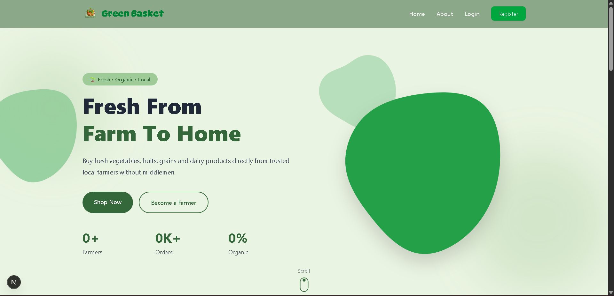
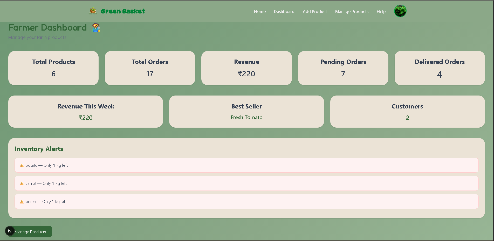
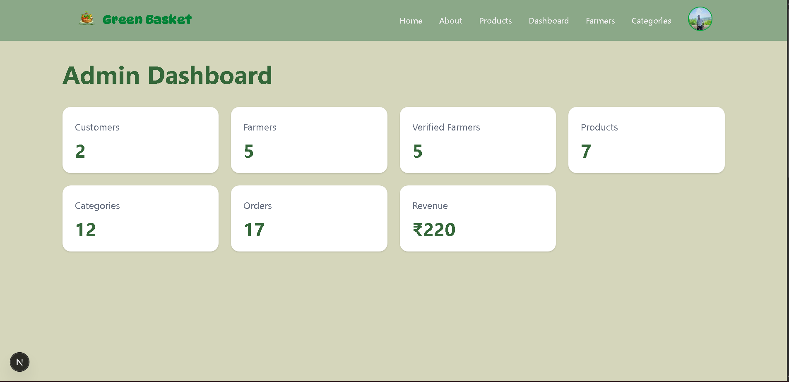
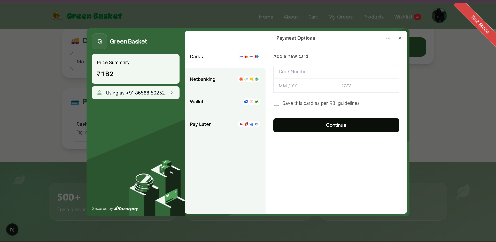

# Green Basket 🌱

Green Basket is a full-stack agricultural marketplace that connects local farmers directly with customers. Farmers can showcase and manage their products, while customers can browse fresh produce, place orders, and make online payments securely.

Built with modern web technologies, Green Basket aims to simplify farm-to-consumer commerce and support local agriculture.

---

## ✨ Features

### 👤 Authentication & Authorization

- User registration and login
- Google OAuth authentication
- JWT-based authentication
- Role-based access control
- Customer, Farmer, and Admin roles
- Protected routes

### 🧑‍🌾 Farmer Features

- Farmer dashboard
- Product inventory management
- Add, edit, and delete products
- Quick stock increase/decrease
- Order management
- Revenue analytics
- Sales statistics
- Recent orders overview
- Product stock alerts
- Help center

### 🛒 Customer Features

- Browse marketplace products
- Product search and filtering
- Product categories
- Wishlist management
- Shopping cart
- Checkout system
- Cash on Delivery (COD)
- Razorpay payment integration
- Order history
- User profile management

### 🛠️ Admin Features

- Verify farmers
- Manage all products
- View all orders
- Platform analytics
- Feature/unfeature products
- Manage users

### 📦 Inventory Management

- Track available stock
- Low stock warnings
- Out-of-stock status
- Automatic stock updates
- Product quantity management

### 💳 Payments

- Razorpay integration
- Test mode support
- Online payments
- Cash on Delivery
- Payment status tracking
- Transaction records

### 🎨 UI & UX

- Responsive design
- Mobile-friendly interface
- Modern dashboard
- Matcha-green themed UI
- Loading states
- Toast notifications
- Animations with Framer Motion

---

# 🛠️ Tech Stack

## Frontend

- Next.js 16
- React
- Tailwind CSS
- React Query
- Axios
- Framer Motion
- React Hook Form
- Zod
- React Hot Toast
- React Icons

## Backend

- Node.js
- Express.js
- MongoDB
- Mongoose
- JWT Authentication
- Bcrypt
- Multer

## Payment Gateway

- Razorpay

## Authentication

- JWT
- Google OAuth

---

# 📁 Project Structure

```bash
greenBasket/

├── frontend/
│   ├── app/
│   ├── components/
│   ├── services/
│   ├── hooks/
│   ├── context/
│   └── lib/
│
├── backend/
│   ├── controllers/
│   ├── models/
│   ├── routes/
│   ├── middleware/
│   ├── config/
│   └── utils/
│
└── README.md
```

---

# ⚙️ Installation

## Clone the repository

```bash
git clone https://github.com/your-username/greenBasket.git

cd greenBasket
```

---

## Backend Setup

```bash
cd backend

npm install
```

Create a `.env` file inside the backend folder:

```env
PORT=5000

MONGO_URI=your_mongodb_connection_string

JWT_SECRET=your_secret_key

GOOGLE_CLIENT_ID=your_google_client_id

GOOGLE_CLIENT_SECRET=your_google_client_secret

RAZORPAY_KEY_ID=your_razorpay_key

RAZORPAY_SECRET=your_razorpay_secret
```

Run the backend:

```bash
npm run dev
```

---

## Frontend Setup

```bash
cd frontend

npm install
```

Create a `.env.local` file:

```env
NEXT_PUBLIC_API_URL=http://localhost:5000/api

NEXT_PUBLIC_GOOGLE_CLIENT_ID=your_google_client_id

NEXT_PUBLIC_RAZORPAY_KEY=your_razorpay_key
```

Run the frontend:

```bash
npm run dev
```

---

# 🚀 Environment Variables

### Backend

```env
PORT=
MONGO_URI=
JWT_SECRET=
GOOGLE_CLIENT_ID=
GOOGLE_CLIENT_SECRET=
RAZORPAY_KEY_ID=
RAZORPAY_SECRET=
```

### Frontend

```env
NEXT_PUBLIC_API_URL=
NEXT_PUBLIC_GOOGLE_CLIENT_ID=
NEXT_PUBLIC_RAZORPAY_KEY=
```

---

# 📸 Screenshots

## Home Page



---


## Farmer Dashboard



---

## Admin Dashboard



---

## Checkout & Payment




# 🔐 User Roles

| Role     | Permissions                                   |
| -------- | --------------------------------------------- |
| Customer | Browse products, order, wishlist, checkout   |
| Farmer   | Manage products, stock, orders, analytics     |
| Admin    | Verify farmers, manage platform and products |

---

# 📊 Future Improvements

- Email notifications
- Forgot password
- Dark mode
- Real-time notifications
- Sales charts
- AI product recommendations
- Multi-language support
- Invoice generation

---

# 🧪 Test Credentials

### Customer

```text
Email:
Password:
```

### Farmer

```text
Email:
Password:
```

### Admin

```text
Email:
Password:
```

---

# 🤝 Contributing

Contributions, issues, and feature requests are welcome.

Feel free to fork the repository and submit a pull request.

---

# 📄 License

This project is licensed under the MIT License.

---

# 👨‍💻 Author

Developed by Jyoti ranjan sahoo

GitHub: https://github.com/your-username

LinkedIn: https://linkedin.com/in/your-profile

---

⭐ If you like this project, consider giving it a star.